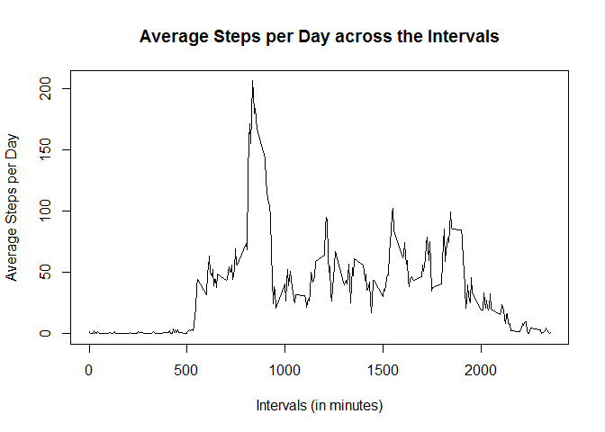

# Reproducible Research: Peer Assessment 1


## Loading and preprocessing the data

```r
rawData <- read.csv("activity.csv")

rawData$date <- as.Date(rawData$date, "%Y-%m-%d")

cleanData <- rawData[complete.cases(rawData),]
```

## What is mean total number of steps taken per day?

```r
library(data.table)
dt <- data.table(cleanData)
byDate <- dt[, sum(steps), by = date]

hist(byDate$V1, main="Histogram of Steps per Day", xlab="Steps per Day")
```

 


```r
meanSteps <- mean(byDate$V1)
medianSteps <- median(byDate$V1)
```

- Mean number of steps per day = 1.0766189\times 10^{4}

- Median number of steps per day = 10765

## What is the average daily activity pattern?


```r
meanByInterval <- dt[, as.integer(mean(steps)), by = interval]

plot(meanByInterval, type="l", ylab="Average Steps per Day",
     xlab="Intervals (in minutes)",
     main="Average Steps per Day across the Intervals")
```

 

## Imputing missing values

```r
missingRows <- !complete.cases(rawData)
```
- The number of rows with missing data is 2304


```r
# Use the mean steps for the intervals to impute missing values.
# Create a new data set with the imputed values
impData <- rawData

for (i in 1:length(impData$steps)) {
  if (is.na(impData[i,]$steps)) {
      impData[i,]$steps <- meanByInterval[interval == impData[i,]$interval]$V1
  }
}

# Show histogram with imputed values
dt <- data.table(impData)
byDate <- dt[, sum(steps), by = date]

hist(byDate$V1, main="Histogram of Steps per Day (with imputed values)", xlab="Steps per Day")
```

 


```r
meanSteps <- mean(byDate$V1)
medianSteps <- median(byDate$V1)
```

- Mean number of steps per day = 1.074977\times 10^{4}

- Median number of steps per day = 10641

- Do these values differ from the estimates from the first part of the assignment?

Yes

- What is the impact of imputing missing data on the estimates of the total daily number of steps?

The total daily number of steps per day increases since we now have added data.  However, the mean and median decrease slightly due to the fact that many 0 values were added in place of the NAs.

## Are there differences in activity patterns between weekdays and weekends?

```r
library(lattice)

dayOfWeek <- weekdays(impData$date)

isWeekend <- (dayOfWeek == "Saturday" | dayOfWeek == "Sunday")

impData$day.type <- factor(isWeekend, labels = c("weekday", "weekend"))

dt <- data.table(impData)
byDateAndType <- dt[, mean(steps), by = list(interval,day.type)]

xyplot(V1~interval|day.type, data = byDateAndType,
       layout=c(1,2), type='l',
       ylab="Number of Steps",
       xlab="Interval")
```

 
